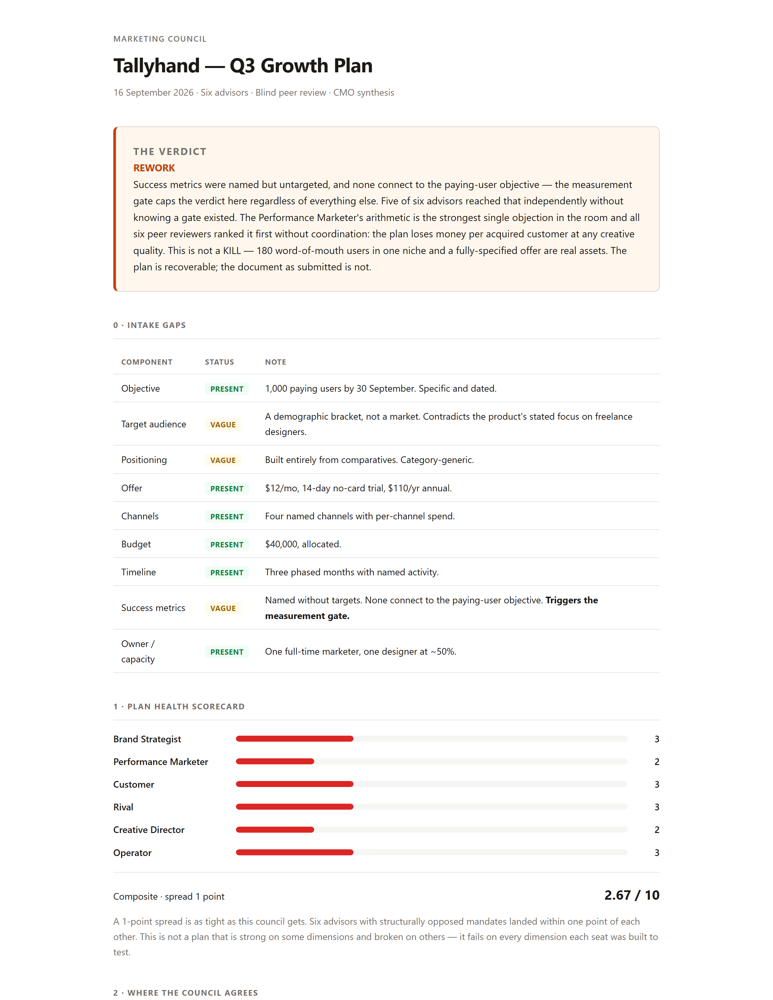

# A worked example

One complete run of the council, kept unedited so you can see what the skill actually produces
before installing it.

The plan is fictional — **Tallyhand**, an invented invoicing tool for freelance designers. It was
written to be *average*: the kind of competent, unremarkable document a small team really produces,
with a clear objective, an allocated budget, and a soft middle. Everything after the plan is the
skill's real output.

| File | What it is |
|---|---|
| [`sample-plan.md`](sample-plan.md) | The plan that went in |
| [`sample-transcript.md`](sample-transcript.md) | The full run — intake gate, six advisors, anti-drift check, blind peer review with the anonymisation mapping revealed, and the chairman's synthesis |
| [`sample-report.html`](sample-report.html) | The HTML scorecard. Download and open it — GitHub shows HTML as source, not rendered |
| `sample-report.png` | The top of that report, shown below |

---

## The verdict



---

## What to look at

**The scores barely differ — and that is the finding.** Six advisors with structurally opposed
mandates returned 3, 2, 3, 3, 2, 3. A 1-point spread means the plan does not fail on one dimension;
it fails on every dimension each seat was built to test. A wide spread would have been better news.

**The measurement gate did the work.** Success metrics were named (engagement, followers, traffic,
rankings) but had no targets and no connection to the paying-user objective. That caps the verdict at
REWORK no matter how the plan scores elsewhere. Five of six advisors independently said the metrics
could not detect failure, without knowing a gate existed.

**Round two found what round one could not.** Every advisor treated 60% month-three retention as an
input or a kill criterion. Four of six peer reviewers, blind to each other, said the same thing:
retention is the lever, not acquisition, and nobody proposed spending a dollar on the 180 existing
users — the only channel in the plan with proven conversion. Two reviewers separately noticed that
the $12 price went entirely unchallenged. None of that appears in round one. It is the whole reason
the peer round exists.

**Five of six reviewers defunded the same line.** Asked to move 20% of the budget, five took the
$8,000 out of content and SEO and put the majority into retention and onboarding. Six independent
allocations, one shape. That convergence is the strongest signal the council produces.

**The council contradicts itself and the transcript keeps it.** Section 3 has the Creative Director
and the Performance Marketer in an unresolved argument about whether better creative could rescue the
plan. The chairman does not split the difference. It sides with the arithmetic, then explicitly
discards the Creative Director's headline recommendation — while noting that all six reviewers
accepted the diagnosis behind it and rejected only the prescription.

---

## Reproducing this

Install the skill, save `sample-plan.md` somewhere, and run:

```
marketing council — review the plan in sample-plan.md
```

You will not get this transcript back word for word. The advisors are independent samples, so the
wording, the emphasis and sometimes a score will move. What should hold is the shape: the intake gate
catching the same three vague components, the measurement gate capping the verdict at REWORK, and the
peer round surfacing retention as the lever the advisors missed.
